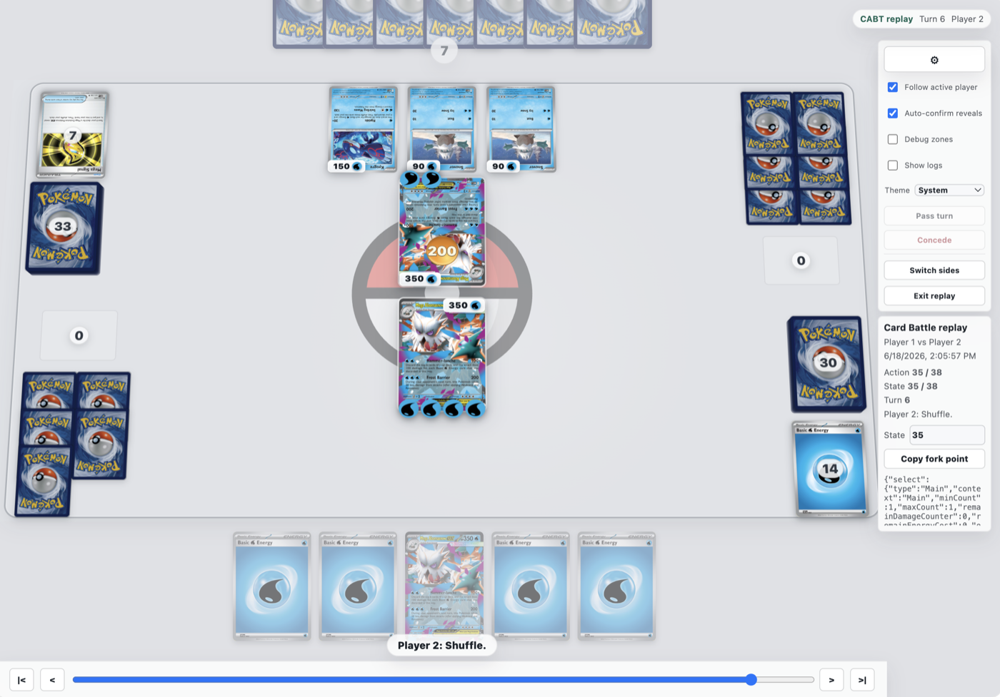

# CABT Viewer

Svelte 5 viewer for CABT, the Card Battle environment used by the Kaggle
Pokemon TCG AI Battle Challenge.

This repo contains the viewer, replay support, generated card metadata, and a
thin optional local engine bridge. It also includes public sample agents adapted
from Kaggle-provided examples. It does not include Kaggle's native CABT engine
files or raw card CSV.



## Requirements

- Node.js `>=20.19.0 <25`
- npm
- Optional for local CABT play on macOS: Docker
- Optional for local CABT play: Kaggle's provided `sample_submission`
  directory from the competition data bundle

The provided CABT engine ships native Linux x86-64 and Windows x64 libraries.
On macOS, the bridge runs the Linux library through Docker.

## Quick Start

```bash
npm ci
npm run dev:web
```

Open `http://localhost:5173/?view=replay`.

The app loads generated sample replay fixtures from `public/game-logs`. You can
also pass a replay URL:

```text
http://localhost:5173/?view=replay&replayUrl=https://example.com/cabt-replay.json
```

Replay viewing does not require Python, Docker, Kaggle native libraries, or a
local agent.

## Run Local CABT Play

Local play requires the Kaggle-provided sample submission files:

```text
sample_submission/
  main.py
  deck.csv
  cg/
    api.py
    game.py
    sim.py
    utils.py
    libcg.so
    cg.dll
```

Point the bridge at that directory:

```bash
export CABT_SAMPLE_SUBMISSION_DIR=/absolute/path/to/sample_submission
npm run dev
```

Then open `http://localhost:5173`.

The opponent selector includes:

- `First legal option`: generic fallback policy that uses the editable opponent
  deck text box.
- `Official random sample (Mega Abomasnow)`: Kaggle sample-submission policy
  with its Mega Abomasnow ex deck.
- `Rule-based Mega Lucario ex`: Kaggle notebook sample with its deck.
- `Rule-based Dragapult ex`: Kaggle notebook sample with its deck.

Deck-backed sample agents load their bundled `deck.csv` into the opponent deck
box and make it read-only so the agent and deck stay paired.

On Linux, the bridge uses your local Python. On macOS, it starts Docker with
`--platform linux/amd64` and mounts `CABT_SAMPLE_SUBMISSION_DIR` read-only into
the container.

If you only want to inspect the UI without CABT native engine resources, use
the replay viewer or set `CABT_ENGINE_MODE=demo` before running `npm run dev`.

Dev servers bind to `127.0.0.1` by default. To test from another device on your
LAN, run `npm run dev:lan`.

## Regenerate CABT Metadata

Generated metadata is committed in `src/lib/cabt` so a fresh clone can show
card names, set numbers, images, HP, retreat costs, abilities, and attacks in
replay mode without starting the native CABT engine.

Most users do not need to regenerate it. Maintainers can refresh it from the
Kaggle-provided card CSV and sample submission.

By default, the generator expects these local, ignored paths inside this repo:

```text
data/EN_Card_Data.csv
sample_submission/
```

Use Docker on macOS:

```bash
npm run generate:cabt-data:docker
```

On Linux, or any machine that can load the provided native CABT library
directly, you can run:

```bash
npm run generate:cabt-data
```

You can override those paths:

```bash
npm run generate:cabt-data -- \
  --card-csv /absolute/path/to/EN_Card_Data.csv \
  --sample-submission /absolute/path/to/sample_submission
```

The Docker helper mounts this repo at `/workspace`. For arbitrary external
paths, either run the native command on Linux or adapt the Docker mount paths.

## Data Contract

The viewer speaks a normalized `GameView` shape internally, but the CABT adapter
understands:

- Kaggle environment replay contexts where `environment.steps[0][0]` contains
  CABT `visualize` frames.
- Lower-level local runner JSON with a top-level `visualize` array.
- Live CABT observations from `cg.game.battle_start` / `battle_select`.

The local engine bridge follows the official agent interaction shape:

- before battle start, each agent supplies a 60-card deck;
- during battle, actions are arrays of option indexes;
- each index refers to an item in the current `obs.select.option` list.

## Useful Scripts

```bash
npm run dev       # local engine server + Vite dev server
npm run dev:lan   # same as dev, but binds to 0.0.0.0 for LAN testing
npm run dev:web   # Vite dev server only
npm run dev:web:lan
npm run generate:cabt-data:docker
npm test          # Vitest suite
npm run build     # TypeScript + production build
```

## Notes

- Full card art is loaded from external image URLs when set and collector
  numbers are available; the repo only bundles local UI/energy assets.
- `dist/`, `node_modules/`, and local `.env` files are ignored and should not be
  committed.

## License

MIT.
